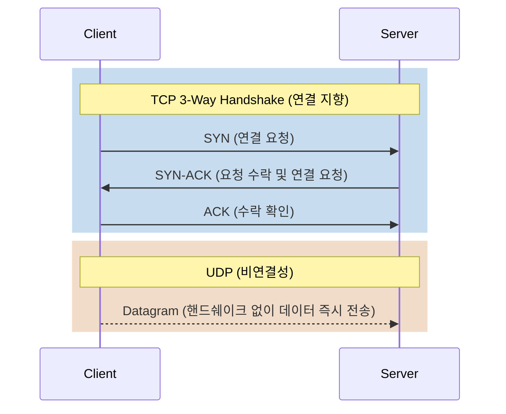
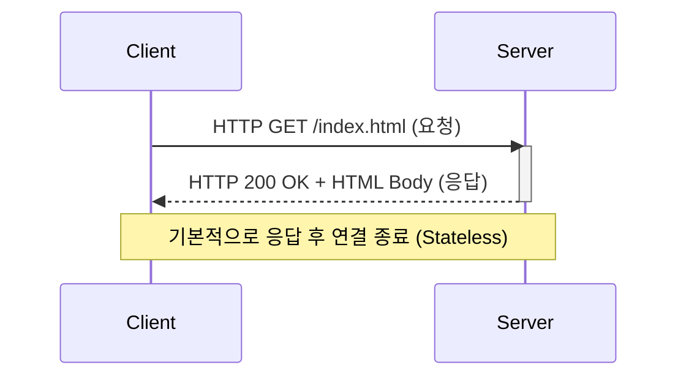
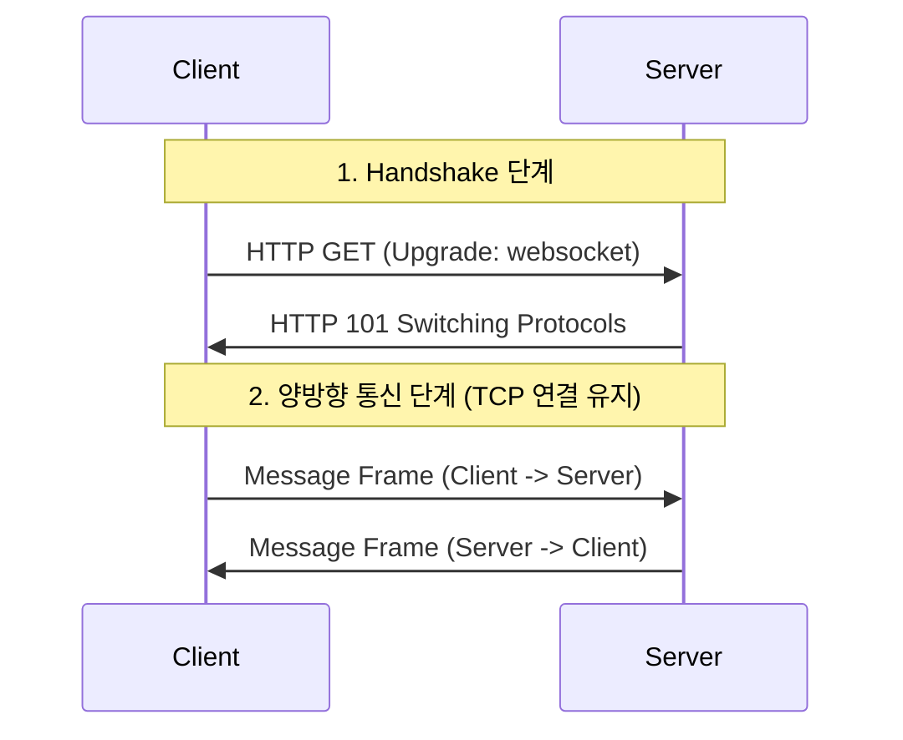
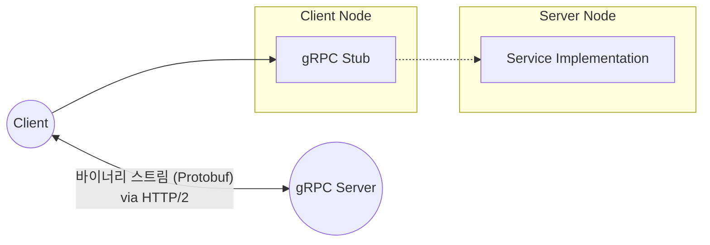
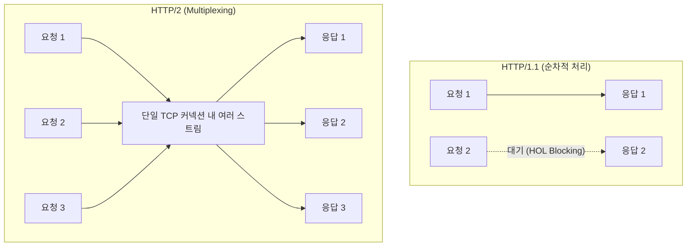

# Communication Protocols

이 프로젝트는 다양한 통신 프로토콜의 동작 원리를 학습하고, 단순한 **레이어드 아키텍처(Layered Architecture)** 기반으로 코드를 직접 구현해 보며 통신 계층의 본질을 이해하는 것을 목표로 합니다.

## 학습 커리큘럼 및 순서

학습은 저수준의 기반 통신 기술부터 고수준의 응용 계층 및 최신 트렌드 순서로 진행됩니다.

---

### 1단계: 통신의 기초와 전송 계층 (Transport Layer)
모든 고수준 프로토콜의 뼈대가 되는 계층으로, 데이터가 네트워크를 통해 어떻게 전달되는지 그 기본을 다룹니다.

* **핵심 프로토콜**: TCP, UDP
* **학습 목표**: TCP의 신뢰성 보장 메커니즘(3-Way Handshake)과 UDP의 비연결성 특징 이해

---

### 2단계: 웹 통신의 표준 (Request-Response)
현대 웹 서비스의 근간이 되는 HTTP 통신의 요청과 응답 구조를 파악합니다.

* **핵심 프로토콜**: HTTP/1.1
* **학습 목표**: 헤더(Header)와 바디(Body)의 구조, HTTP 메서드, 상태 코드, 무상태성(Stateless)의 이해

---

### 3단계: 실시간 및 양방향 통신
HTTP의 단방향 통신 한계를 극복하고, 실시간으로 데이터를 주고받는 방법을 학습합니다.

* **핵심 프로토콜**: WebSocket, SSE (Server-Sent Events)
* **학습 목표**: HTTP를 통한 웹소켓 핸드쉐이크(Upgrade) 및 지속적인 양방향 데이터 스트림 이해

---

### 4단계: 현대적인 RPC와 바이너리 통신 (Microservices)
마이크로서비스 아키텍처(MSA)에서 서비스 간 통신 효율을 극대화하기 위한 바이너리 통신 방식을 배웁니다.

* **핵심 프로토콜**: gRPC, Protocol Buffers
* **학습 목표**: JSON과 같은 텍스트 기반 직렬화와 Protobuf의 바이너리 직렬화 비교, 원격 프로시저 호출(RPC)의 개념 이해

---

### 5단계: 웹의 진화와 성능 최적화 (Advanced)
웹 통신 과정에서 발생한 성능적 병목 현상을 해결하기 위한 최신 프로토콜의 발전사를 다룹니다.

* **핵심 프로토콜**: HTTP/2, HTTP/3 (QUIC)
* **학습 목표**: HTTP/2의 멀티플렉싱(Multiplexing), HTTP/3가 UDP(QUIC)를 선택한 이유 이해

## 아키텍처 원칙
본 프로젝트의 모든 코드는 프로토콜의 규약과 파싱 로직에 집중하기 위해, 복잡한 디자인 패턴을 배제하고 단순한 **레이어드 아키텍처(Layered Architecture)**로 구현됩니다.
- **Handler/Controller Layer**: 네트워크 소켓 통신 및 프로토콜 파싱/직렬화 담당
- **Service Layer**: 단순한 비즈니스 로직 (예: 에코, 메시지 브로드캐스팅 등) 처리