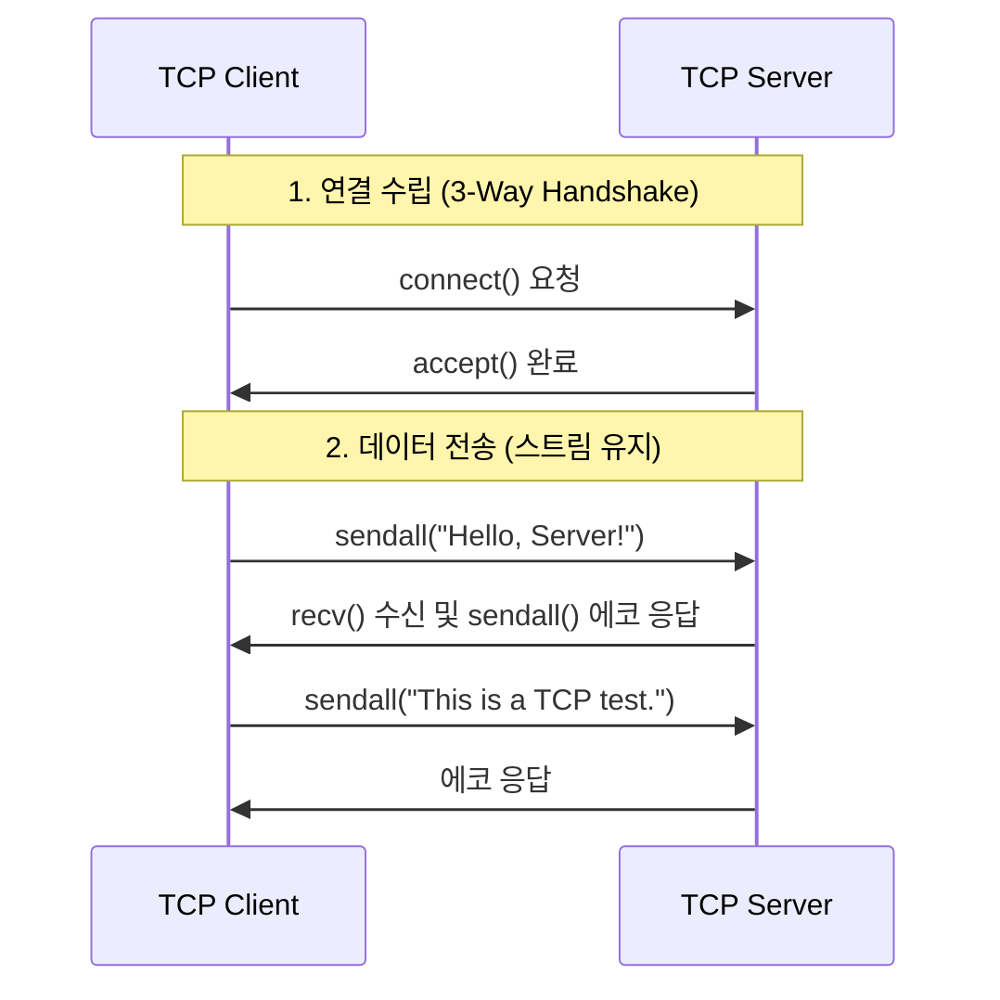
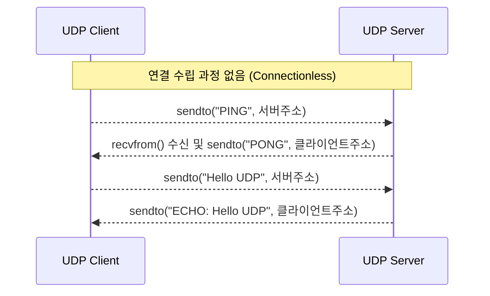

# 1단계: TCP & UDP (전송 계층 통신의 기초)

이 폴더에서는 파이썬의 가장 원시적인 `socket` 라이브러리를 사용하여 통신의 기초인 TCP와 UDP를 바닥부터 구현해 봅니다.

## 🎯 학습 목표
웹 프레임워크나 HTTP 라이브러리가 내부적으로 통신을 어떻게 시작하고 유지하는지 파악합니다. 특히 코드를 통해 **"연결 지향(TCP)"**과 **"비연결성(UDP)"**의 차이를 명확하게 눈으로 확인합니다.

---

## 💻 실행 방법

### 1. TCP 에코(Echo) 테스트
터미널을 2개 열어주세요.

**터미널 1 (서버 실행):**
```bash
python tcp-echo/server.py
```
> 서버가 실행되고 클라이언트의 접속을 기다립니다 (`listen` 및 `accept`).

**터미널 2 (클라이언트 실행):**
```bash
python tcp-echo/client.py
```
> 클라이언트가 접속하여 3번의 메시지를 보내고, 서버가 똑같은 메시지를 응답하는 것을 확인할 수 있습니다.



### 2. UDP 핑퐁(Ping-Pong) 테스트
터미널을 2개 열어주세요.

**터미널 1 (서버 실행):**
```bash
python udp-ping/server.py
```
> UDP 서버는 `listen`이나 `accept` 과정 없이 곧바로 메시지 수신 대기 상태에 들어갑니다.

**터미널 2 (클라이언트 실행):**
```bash
python udp-ping/client.py
```
> 클라이언트가 'PING'을 보내면 서버가 'PONG'으로 응답합니다.



---

## 🔍 핵심 관전 포인트 (코드 레벨의 차이)

코드(`server.py`, `client.py`)를 열어보고 아래의 차이점을 직접 확인해 보세요.

### TCP의 특징 (연결 지향)
1. **서버의 연결 수락 과정**: `server_socket.accept()`를 통해 클라이언트와 통신할 수 있는 **전용 파이프(conn)**를 생성합니다.
2. **상태 유지**: 한 번 연결되면 파이프가 끊어질 때까지 계속해서 `conn.recv()`와 `conn.sendall()`을 통해 데이터를 주고받습니다. (연결 유지)
3. **오류**: 서버를 끄고 클라이언트를 실행하면, 3-Way Handshake를 할 수 없으므로 **즉시 에러(ConnectionRefusedError)가 발생**합니다.

### UDP의 특징 (비연결성)
1. **연결 수락 과정 없음**: 서버에 `listen()`이나 `accept()` 함수 자체가 없습니다. 바인딩만 해두면 누구나 메시지를 던질 수 있습니다.
2. **매번 주소 명시**: 전용 파이프(세션)가 없기 때문에 서버가 응답을 보낼 때마다 `server_socket.sendto(데이터, 목적지_주소)` 처럼 주소를 적어줘야 합니다.
3. **오류 침묵**: 서버를 끄고 클라이언트를 실행해도 클라이언트는 **에러를 내지 않고 조용히 타임아웃**만 발생합니다. (UDP는 상대방이 듣고 있는지 신경 쓰지 않고 일단 데이터를 허공에 던지기 때문입니다.)
