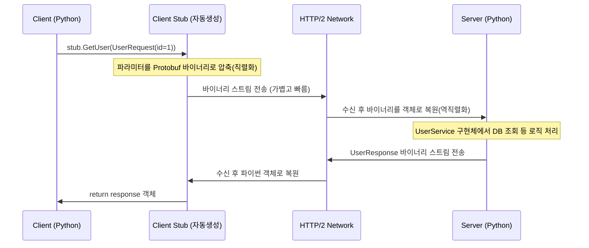

# 4단계: gRPC와 Protocol Buffers (현대적인 RPC)

마이크로서비스 아키텍처(MSA)에서 압도적인 성능과 편리함을 자랑하는 gRPC 통신을 구현합니다.

## 🎯 학습 목표
1. **바이너리 직렬화**: JSON처럼 사람이 읽을 수 있는 텍스트가 아니라, 컴퓨터가 읽기 편한 바이너리 형태로 데이터를 압축(Protobuf)하여 전송 속도를 높이는 원리를 체감합니다.
2. **RPC (Remote Procedure Call)**: 클라이언트에서 URL 문자열을 조합해 요청을 보내는 REST API와 달리, 클라이언트 코드에서 `stub.GetUser()`처럼 **원격 서버의 함수를 마치 내 로컬 함수처럼 호출하는 패러다임**을 배웁니다.

---

## 💻 실행 방법

### 1. 패키지 설치
gRPC 핵심 라이브러리와 Protobuf 컴파일러 도구를 설치합니다.
```bash
pip install -r stage4-grpc/requirements.txt
```

### 2. Protocol Buffers 컴파일 (★매우 중요)
`.proto` 파일에 언어 중립적으로 정의된 인터페이스를 **파이썬 코드로 자동 생성(컴파일)**하는 마법의 과정입니다. `stage4-grpc` 폴더 안에서 아래 명령어를 실행하세요.

```bash
cd stage4-grpc

# 파이썬 gRPC 컴파일 명령어 (전체 복사해서 붙여넣으세요)
python -m grpc_tools.protoc -I. --python_out=./protos --grpc_python_out=./protos protos/user.proto
```
> **성공 확인**: 위 명령어를 실행하고 나면 `protos/` 폴더 안에 `user_pb2.py` (데이터 클래스들)와 `user_pb2_grpc.py` (통신 함수들) 두 개의 파일이 새로 생겨납니다. 이 파일들이 있어야 서버와 클라이언트가 동작합니다!

### 3. 서버 및 클라이언트 실행
터미널을 두 개 열고 테스트를 진행합니다.

**터미널 1 (서버 실행):**
```bash
# stage4-grpc 폴더 안에서 실행
python server.py
```

**터미널 2 (클라이언트 실행):**
```bash
# stage4-grpc 폴더 안에서 실행
python client.py
```
> 클라이언트 로그를 통해 ID가 1인 유저의 정보를 성공적으로 가져오는 것과, ID가 99인 유저는 에러(NOT_FOUND)로 처리되는 과정을 확인하세요.

---

### 📡 동작 흐름도 (gRPC & RPC 호출)



---

## 🔍 핵심 관전 포인트
- `protos/user.proto` 파일을 열어보세요. 이 짧은 코드 몇 줄이 클라이언트와 서버 간의 **완벽한 계약서(Contract)** 역할을 합니다. 클라이언트가 어떤 언어로 작성되었든 이 파일만 있으면 통신할 수 있습니다.
- `client.py`를 열어보세요. HTTP URL (`http://.../users/1`) 이나 HTTP 메서드 (`GET`) 같은 라우팅 문자열이 코드에 전혀 없습니다. 오직 `stub.GetUser(request)`라는 순수한 함수 호출뿐입니다. 이것이 바로 원격 프로시저 호출(RPC)의 강력함입니다!
