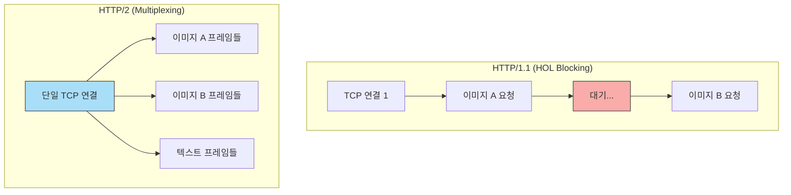

# 5단계: 웹의 진화 (HTTP/2 멀티플렉싱과 HTTP/3)

웹 통신 성능의 병목을 해결하기 위해 등장한 HTTP/2와 HTTP/3의 핵심 원리를 배우고, HTTP/2의 꽃인 **멀티플렉싱(Multiplexing)**을 직접 눈으로 확인합니다.

---

## 🎯 핵심 이론 파헤치기

### 1. HTTP/1.1의 문제: 차 막힘 현상 (HOL Blocking)
HTTP/1.1은 기본적으로 한 번의 TCP 연결(Connection)에서 하나의 요청과 응답만 순차적으로 처리할 수 있습니다.
- **상황**: 브라우저가 이미지 A, B, C를 요청합니다.
- **문제**: A 이미지가 너무 커서 다운로드에 10초가 걸린다면, B와 C는 꼼짝없이 10초를 기다려야 합니다. 이를 **Head-of-Line (HOL) Blocking** 이라고 부릅니다.
- **임시방편**: 브라우저는 어쩔 수 없이 TCP 연결(도로) 자체를 6개씩 뚫어서 병렬 다운로드를 시도했습니다. 하지만 이는 서버와 클라이언트 모두에게 리소스 낭비가 큽니다.

### 2. HTTP/2의 해결책: 멀티플렉싱 (Multiplexing)
HTTP/2는 데이터를 거대한 텍스트 덩어리가 아닌 '바이너리 프레임(Frame)' 단위로 잘게 쪼갭니다.
- **해결**: 단 **1개의 TCP 연결** 안에서, A, B, C 이미지의 프레임들을 마구잡이로 섞어서 동시에(병렬로) 보냅니다. 브라우저는 프레임의 번호표를 보고 다시 조립합니다.
- **결과**: 앞차가 막혀도 뒷차가 차선 사이로 유유히 빠져나갈 수 있게 되었습니다! (HTTP 계층의 HOL Blocking 해결)

### 3. HTTP/3의 등장: TCP를 버리고 UDP(QUIC)로!
HTTP/2가 완벽해 보였지만, 치명적인 약점이 있었습니다. 바로 기반이 되는 TCP 도로의 성질입니다.
- **TCP의 한계**: TCP는 데이터 유실을 절대 용납하지 않습니다. 프레임이 섞여서 오다가 **물리적 네트워크 망에서 패킷 하나라도 유실되면, TCP는 그 패킷을 재전송받을 때까지 전체 통로를 꽉 막아버립니다.** (TCP 계층의 HOL Blocking)
- **HTTP/3의 해결책**: 신뢰성에 집착하는 낡은 도로(TCP)를 아예 버리고, 1단계에서 배웠던 아무 규칙 없는 허허벌판(**UDP**) 위에 **QUIC** 이라는 새로운 고속도로를 구글이 직접 깔았습니다. A 데이터 패킷이 유실되어도 B, C 데이터는 멈춤 없이 통과합니다.

---

### 📡 통신 구조 비교 다이어그램



---

## 💻 실행 및 확인 방법 (HTTP/2 멀티플렉싱 시뮬레이션)

브라우저 규약상 HTTP/2 통신은 **반드시 HTTPS(보안/TLS) 연결**에서만 동작합니다.

### 1. 패키지 설치
```bash
pip install -r stage5-http2-3/requirements.txt
```

### 2. 로컬 HTTPS 인증서 생성
HTTPS 서버를 띄우기 위한 인증서(`cert.pem`)와 키(`key.pem`) 파일을 파이썬 코드로 자동 생성합니다. (OpenSSL 등 별도 프로그램 설치 불필요)
```bash
cd stage5-http2-3
python generate_cert.py
```

### 3. 서버 실행 (Hypercorn 사용)
FastAPI의 기본 서버(Uvicorn) 대신, HTTP/2를 완벽 지원하는 `hypercorn`을 사용합니다. 앞서 만든 인증서를 물려서 실행합니다.
```bash
# stage5-http2-3 폴더 안에서 실행
hypercorn main:app --bind localhost:8443 --certfile cert.pem --keyfile key.pem
```

### 4. 눈으로 멀티플렉싱 체감하기
1. 웹 브라우저를 엽니다.
2. 개발자 도구(F12)를 열고 **[Network] (네트워크)** 탭을 켭니다. (이때 컬럼을 우클릭하여 `Protocol` 열이 보이도록 설정해 두세요.)
3. **https://localhost:8443/** 에 접속합니다. 
   *(주의: 자체 서명 인증서라 '안전하지 않은 연결' 경고가 뜹니다. 고급 ➡️ 안전하지 않음으로 계속하기(Proceed to localhost)를 누르세요.)*
4. **결과 확인**:
   - 30개의 이미지가 폭포수 탭에서 계단식이 아니라 **가로로 똑같이 줄을 서서 동시에 로딩**되는 장관을 확인하세요.
   - 30개의 요청 모두 **동일한 Connection ID**를 가지며, Protocol 항목이 `h2` (HTTP/2)로 찍히는 것을 볼 수 있습니다.
